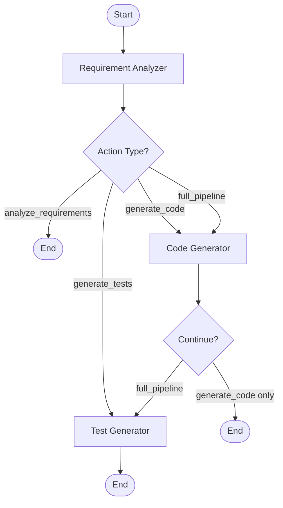

# 🚀 AI SDLC Agent

An AI-native SDLC orchestration system that automates requirement analysis, code generation, and test creation using real SDLC data from Jira and GitHub.

## 🎯 What This Project Is

**This is NOT:**
- A ChatGPT wrapper
- A code autocomplete tool like Codex
- A general chatbot like Gemini

**This IS:**
- An AI agent fabric that automates requirement analysis, code generation, and test creation
- A multi-agent orchestration system using LangGraph
- A RAG-powered system grounded in real SDLC context

## 🏗️ Architecture

```
┌─────────────────────────────────────────────────────────────┐
│                    Frontend (React)                         │
│  ┌─────────────┐  ┌─────────────┐  ┌─────────────┐         │
│  │ Input Screen│  │Agent Status │  │Results View │         │
│  └─────────────┘  └─────────────┘  └─────────────┘         │
└─────────────────────────────────────────────────────────────┘
                            │
                            ▼
┌─────────────────────────────────────────────────────────────┐
│                   FastAPI Gateway                           │
└─────────────────────────────────────────────────────────────┘
                            │
                            ▼
┌─────────────────────────────────────────────────────────────┐
│              LangGraph Orchestrator                         │
│  ┌──────────────┐ ┌──────────────┐ ┌──────────────┐        │
│  │ Requirement  │ │    Code      │ │    Test      │        │
│  │   Agent      │→│   Agent      │→│   Agent      │        │
│  └──────────────┘ └──────────────┘ └──────────────┘        │
└─────────────────────────────────────────────────────────────┘
                            │
                            ▼
┌─────────────────────────────────────────────────────────────┐
│           Vector Store (ChromaDB / FAISS)                   │
│  ┌─────────┐  ┌─────────┐  ┌─────────┐  ┌─────────┐        │
│  │  Jira   │  │   PRs   │  │  Code   │  │  Tests  │        │
│  │ Tickets │  │         │  │  Diffs  │  │         │        │
│  └─────────┘  └─────────┘  └─────────┘  └─────────┘        │
└─────────────────────────────────────────────────────────────┘
```

## 🔧 Tech Stack

| Layer | Technology | Purpose |
|-------|------------|---------|
| API | FastAPI | REST endpoints |
| Orchestration | LangGraph | Multi-agent workflows |
| Vector DB | ChromaDB | RAG context storage |
| LLM | GPT-4o/Claude | AI reasoning |
| Integrations | Jira API, GitHub API | Data sources |

## 📁 Project Structure

```
ai-sdlc-agent/
├── app/
│   ├── __init__.py
│   ├── main.py                 # FastAPI entry point
│   ├── config.py               # Configuration settings
│   ├── api/
│   │   ├── __init__.py
│   │   └── routes.py           # API endpoints
│   ├── agents/
│   │   ├── __init__.py
│   │   ├── requirement_agent.py  # Requirement extraction
│   │   ├── code_agent.py         # Code generation
│   │   └── test_agent.py         # Test generation
│   ├── orchestration/
│   │   ├── __init__.py
│   │   └── graph.py            # LangGraph workflow
│   ├── services/
│   │   ├── __init__.py
│   │   ├── jira_service.py     # Jira integration
│   │   ├── github_service.py   # GitHub integration
│   │   └── embedding_service.py # Text embeddings
│   ├── vectorstore/
│   │   ├── __init__.py
│   │   └── chroma_store.py     # Vector database
│   ├── schemas/
│   │   ├── __init__.py
│   │   └── models.py           # Pydantic models
│   └── utils/
│       ├── __init__.py
│       └── logger.py           # Logging utility
├── tests/
│   ├── __init__.py
│   └── test_api.py             # API tests
├── data/
│   └── sample_tickets.json     # Sample data
├── .env.example                # Environment template
├── .gitignore
├── requirements.txt
└── README.md
```

## 🚀 Quick Start

### Prerequisites

- Python 3.10+
- OpenAI API key

### Installation

1. **Clone the repository**
   ```bash
   git clone <repository-url>
   cd ai-sdlc-agent
   ```

2. **Create virtual environment**
   ```bash
   python -m venv venv
   
   # Windows
   venv\Scripts\activate
   
   # macOS/Linux
   source venv/bin/activate
   ```

3. **Install dependencies**
   ```bash
   pip install -r requirements.txt
   ```

4. **Configure environment**
   ```bash
   cp .env.example .env
   # Edit .env and add your OPENAI_API_KEY
   ```

5. **Run the server**
   ```bash
   uvicorn app.main:app --reload
   ```

6. **Access the API**
   - API: http://localhost:8000
   - Docs: http://localhost:8000/docs
   - Health: http://localhost:8000/health

## 📡 API Endpoints

### Health Check
```bash
GET /health
```

### Analyze Ticket
```bash
POST /api/v1/analyze
{
  "ticket_id": "PROJ-123",
  "action": "full_pipeline"
}
```

### Manual Analysis (without Jira)
```bash
POST /api/v1/analyze/manual
{
  "ticket": {
    "title": "Implement authentication",
    "description": "User login feature..."
  },
  "action": "analyze_requirements"
}
```

### List Agents
```bash
GET /api/v1/agents
```

## 🤖 Agents

### 1. Requirement Analyzer Agent
- **Input**: Jira ticket description, acceptance criteria
- **Output**: Structured requirements (functional, non-functional, constraints)
- **Features**: Edge case identification, priority assignment

### 2. Code Generator Agent
- **Input**: Structured requirements, RAG context
- **Output**: Code snippets, diff patches
- **Features**: Pattern matching, coding standards compliance

### 3. Test Generator Agent
- **Input**: Generated code, requirements
- **Output**: Unit tests, integration tests
- **Features**: Edge case coverage, framework matching

## 🔄 Workflow



## 🔐 Configuration

### Environment Variables

| Variable | Description | Required |
|----------|-------------|----------|
| `OPENAI_API_KEY` | OpenAI API key | Yes |
| `JIRA_URL` | Jira instance URL | No |
| `JIRA_EMAIL` | Jira account email | No |
| `JIRA_API_TOKEN` | Jira API token | No |
| `GITHUB_TOKEN` | GitHub personal access token | No |
| `DEBUG` | Enable debug mode | No |
| `LOG_LEVEL` | Logging level | No |

### Secrets & Security

- NEVER commit secrets or `.env` files to version control. This repository's `.gitignore` already excludes `.env` files.
- Local workflow: copy `.env.example` to `.env` and add your real secret values locally only. Do NOT commit the `.env` file.
   ```bash
   cp .env.example .env
   # edit .env locally and paste your keys (DO NOT commit)
   ```
- CI / Deployment: store secrets in your platform's secret store (GitHub Actions Secrets, Azure Key Vault, AWS Secrets Manager, etc.) and inject them as environment variables at runtime.
- Example (GitHub Actions):
   ```yaml
   env:
      OPENAI_API_KEY: ${{ secrets.OPENAI_API_KEY }}
      GITHUB_TOKEN: ${{ secrets.GITHUB_TOKEN }}
   ```
- Rotate tokens regularly and restrict scopes. For `GITHUB_TOKEN` prefer least-privilege PAT scopes or use a deploy key for read-only access.
- Audit your repo for accidental secrets before pushing: `git diff --staged` and `git log -p`.

If you'd like, I can add an optional pre-commit hook to block accidental commits of `.env` or detect token-like strings.

## 🧪 Testing

```bash
# Run all tests
pytest

# Run with coverage
pytest --cov=app

# Run specific test file
pytest tests/test_api.py
```

## 📊 Observability

The system includes:
- Structured logging with loguru
- Token usage tracking
- Execution time monitoring
- Agent status tracking

## 🎯 Key Differentiators

| Feature | Traditional Tools | AI SDLC Agent |
|---------|------------------|---------------|
| Context | None | RAG-powered |
| Workflow | Single prompt | Multi-agent orchestration |
| Grounding | Hallucination-prone | SDLC data grounded |
| Inspection | Black box | LangGraph inspectable |

## 🛣️ Roadmap

- [ ] Real LLM integration (currently mock)
- [ ] Full Jira integration
- [ ] Full GitHub integration
- [ ] React frontend
- [ ] Docker deployment
- [ ] Streaming responses
- [ ] Webhook support

## 📝 License

MIT License

## 🤝 Contributing

Contributions are welcome! Please read the contributing guidelines first.

---

**Interview Positioning:**

> "I built an AI-native SDLC agent fabric that integrates Jira and GitHub, uses RAG for context grounding, and LangGraph for multi-agent orchestration across requirement analysis, code generation, and testing."
